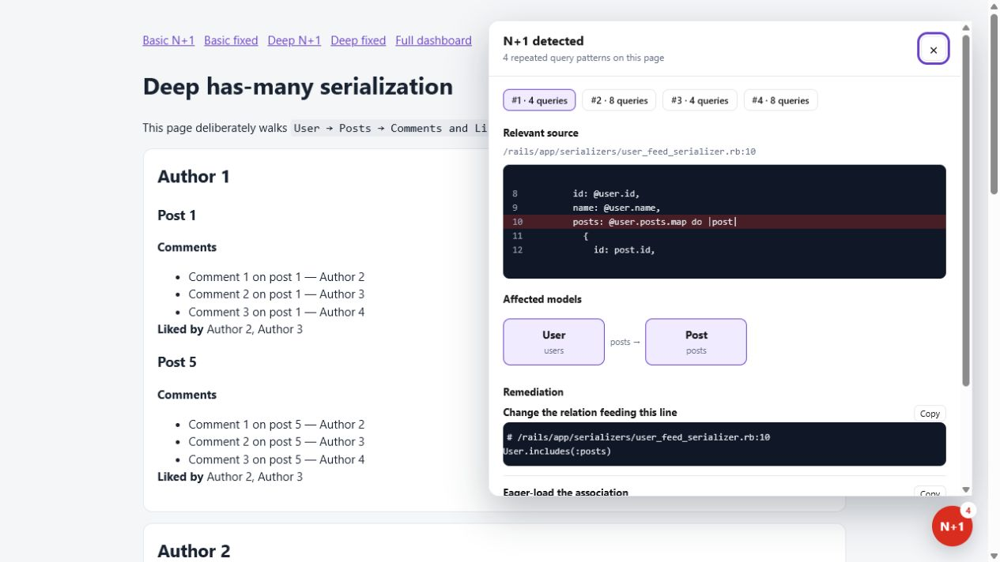

# NPlusInsight

NPlusInsight is a Rails gem that detects repeated query
shapes within a request and turns them into a useful debugging report:

- the exact application file and line that issued the query;
- a model/association graph for the tables involved;
- normalized SQL, repetition count, and total query time;
- suggested `includes` and `strict_loading` fixes.

## Screenshots

### On-page alert

The corner indicator turns red and displays the number of N+1 query patterns
detected while rendering the current page.


### On-page findings popout

Open the indicator to inspect the relevant source lines, affected model graph,
and remediation suggestions without leaving the page.



### Mounted findings dashboard

The mounted dashboard collects recent findings across requests for deeper
inspection.


## Install

Add the gem in every environment where you may enable it:

```ruby
gem "n_plus_insight"
```

Run `bundle install`, then configure NPlusInsight for the environments where it
should be active.

Then configure activation from the environment rather than tying it to a Rails
environment name:

```ruby
# config/initializers/n_plus_insight.rb
if Rails.env.development?
  NPlusInsight.configure do |config|
    config.minimum_repetitions = 2
    config.mount_path = "/n_plus_insight"
    config.on_page = true
    config.max_events = 100
    config.raise_on_detection = false
  end
end
```
With `on_page` enabled, every HTML page also gets a small status circle in the
bottom-right corner. It turns red and shows a count when the current request
contains N+1 query patterns. Select it to inspect source lines, the affected
model graph, and suggested fixes without leaving the page. Set
`config.on_page = false` to remove the on-page tool while retaining collection
and the full dashboard.

## How detection works

The gem listens to `sql.active_record` events during each web request. It
removes literal values from SQL and groups matching shapes. A shape repeated at
least `minimum_repetitions` times is reported. Framework, gem, schema, cached,
transaction, and asset requests are excluded.

This deliberately reports evidence rather than patching source automatically.
Suggested fixes should be reviewed because scopes, polymorphic associations,
and intentionally lazy-loaded data can change the best eager-loading strategy.

## CI mode

To turn findings into failures in a test or staging environment:

```ruby
config.raise_on_detection = true
```

The dashboard is not restricted to a particular Rails environment. If it is
enabled on an internet-facing deployment, protect `/n_plus_insight` with your
application's authentication, authorization, VPN, or reverse-proxy access
controls because findings contain source paths, code excerpts, and SQL shapes.

## License

MIT
