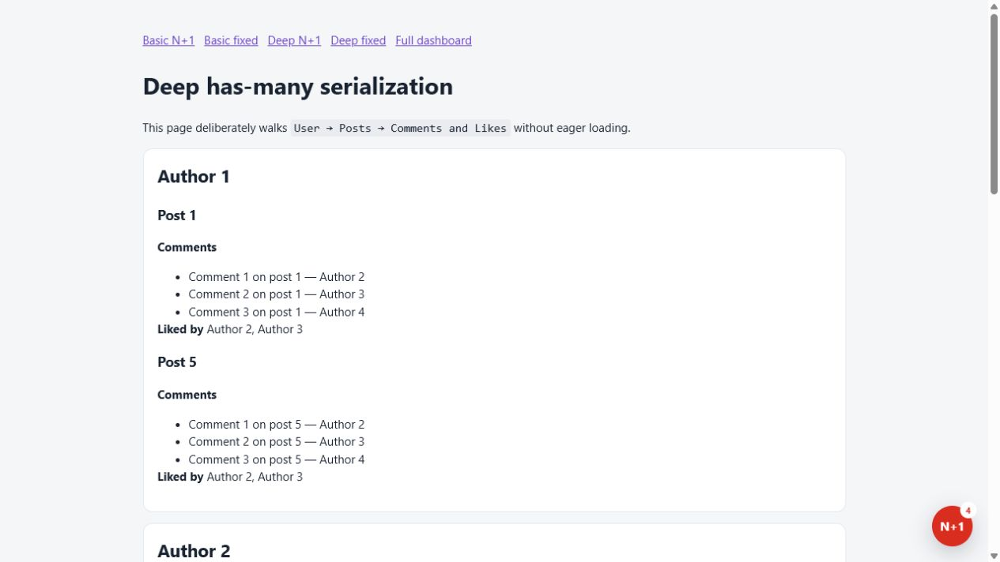
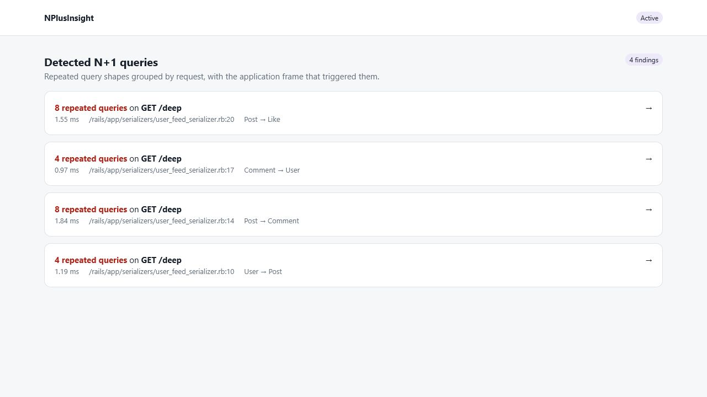

# NPlusInsight

[](https://www.ruby-lang.org/)
[](https://rubyonrails.org/)
[](LICENSE.txt)

[Source code](https://github.com/joryleech/NPlusInsight) ·
[Issue tracker](https://github.com/joryleech/NPlusInsight/issues) ·
[Changelog](CHANGELOG.md)

NPlusInsight detects N+1 queries in Ruby on Rails applications and turns them
into actionable, source-level diagnostics.

For each finding, NPlusInsight shows:

- the application file, line number, and surrounding source code;
- the repeated SQL shape, query count, and cumulative duration;
- the Active Record models and associations involved;
- suggested eager-loading and strict-loading remediations;
- an optional on-page alert and a mounted findings dashboard.

NPlusInsight is environment-neutral. Enable it anywhere you need diagnostics,
including development, test, staging, or a controlled production environment.

## Table of contents

- [Why NPlusInsight?](#why-nplusinsight)
- [Screenshots](#screenshots)
- [Requirements](#requirements)
- [Installation](#installation)
- [Quick start](#quick-start)
- [Configuration](#configuration)
- [Dashboard and on-page inspector](#dashboard-and-on-page-inspector)
- [How detection works](#how-detection-works)
- [Security and privacy](#security-and-privacy)
- [Operational considerations](#operational-considerations)
- [CI and test environments](#ci-and-test-environments)
- [Troubleshooting](#troubleshooting)
- [Development](#development)
- [Contributing](#contributing)
- [Releasing](#releasing)
- [License](#license)

## Why NPlusInsight?

Rails logs make repeated queries visible, but they do not always make the cause
obvious. NPlusInsight connects runtime query evidence to the application code
that triggered it, then presents the affected model relationship and a
candidate fix in one place.

The gem is designed to keep the feedback loop short:

1. Exercise an application page.
2. See the on-page alert when repeated query patterns are detected.
3. Open the finding to inspect the responsible source line and model graph.
4. Apply eager loading.
5. Reload the page and confirm that the finding is gone.

## Screenshots

### On-page alert

The corner indicator turns red and displays the number of N+1 query patterns
detected while rendering the current page.



### On-page findings inspector

Open the indicator to inspect relevant source lines, affected models, and
remediation suggestions without leaving the page.


### Mounted findings dashboard

The mounted dashboard collects recent findings across requests for deeper
inspection.



## Requirements

| Dependency | Supported versions |
| --- | --- |
| Ruby | 3.1 or newer |
| Ruby on Rails | 7.0 through 8.x |
| Active Record | Provided by the Rails application |

## Installation

Add NPlusInsight to the environments where it must be available:

```ruby
# Gemfile
gem "n_plus_insight"
```

Install dependencies:

```sh
bundle install
```

The Rails engine registers its middleware and mounts its dashboard
automatically. No route declaration is required.

## Quick start

Enable NPlusInsight in the Rails environment where you want to use it:

```ruby
# config/environments/development.rb
NPlusInsight.configure do |config|
  config.enabled = true
end
```

Keep shared settings in an initializer:

```ruby
# config/initializers/n_plus_insight.rb
NPlusInsight.configure do |config|
  config.minimum_repetitions = 2
  config.max_events = 100
  config.mount_path = "/n_plus_insight"
  config.on_page = true
  config.raise_on_detection = false
end
```

Start Rails, exercise the application, and visit:

```text
http://localhost:3000/n_plus_insight
```

### Environment-variable activation

For containerized or remotely managed deployments, activation can be driven by
an environment variable:

```ruby
# config/initializers/n_plus_insight.rb
NPlusInsight.configure do |config|
  config.enabled = ENV.fetch("NPLUS_INSIGHT_ENABLED", "false")
    .match?(/\A(?:1|true|yes|on)\z/i)
end
```

The gem uses the same `NPLUS_INSIGHT_ENABLED` parsing when `enabled` is not set
explicitly. Its default value is `false`.

## Configuration

| Option | Default | Description |
| --- | --- | --- |
| `enabled` | `NPLUS_INSIGHT_ENABLED`, otherwise `false` | Enables request-level query collection and analysis. |
| `minimum_repetitions` | `2` | Number of matching query shapes required to create a finding. |
| `max_events` | `100` | Maximum number of findings retained for the dashboard. The oldest findings are removed first. |
| `mount_path` | `"/n_plus_insight"` | Path used for the mounted dashboard and overlay assets. Configure this before the application finishes booting. |
| `on_page` | `true` | Injects the status indicator and findings inspector into HTML responses. |
| `raise_on_detection` | `false` | Raises when a request produces at least one finding. Useful in controlled tests or CI. |
| `ignore_paths` | Asset and Active Storage paths | Array of regular expressions for request paths that should not be analyzed. |
| `ignore_sql` | Transactions and Rails metadata | Array of regular expressions for SQL statements that should be ignored. |

### Ignoring application paths

```ruby
NPlusInsight.configure do |config|
  config.ignore_paths += [
    %r{\A/health\z},
    %r{\A/metrics\z}
  ]
end
```

### Ignoring known query patterns

```ruby
NPlusInsight.configure do |config|
  config.ignore_sql += [
    /FROM "audit_events"/i
  ]
end
```

## Dashboard and on-page inspector

### On-page inspector

When `on_page` is enabled, NPlusInsight injects a small status indicator into
HTML responses:

- green means no repeated query pattern was detected for that request;
- red means one or more patterns were detected;
- the badge shows the number of findings;
- selecting the indicator opens source, model, and remediation details.

Set `config.on_page = false` to disable response injection while continuing to
collect findings for the mounted dashboard.

### Mounted dashboard

The dashboard is available at `mount_path`, which defaults to
`/n_plus_insight`. It lists the most recent findings stored by the current Rails
process and links to a detailed report for each finding. Use **Clear** to remove
all stored findings. The dashboard retains at most `max_events`
findings, rolling off the oldest finding whenever the configured limit is
exceeded.

## How detection works

NPlusInsight subscribes to `sql.active_record` notifications while a web
request is being processed.

For each uncached `SELECT` query, it:

1. captures the first relevant application stack frame;
2. extracts tables referenced by `FROM` and `JOIN`;
3. replaces literal strings and numbers with placeholders;
4. groups queries with the same normalized shape;
5. keeps shapes meeting `minimum_repetitions`;
6. combines repeated shapes attributed to the same application source line into
   one finding;
7. inspects Active Record reflections to infer every relevant model association;
8. renders the affected associations as a model tree;
9. generates combined eager-loading and strict-loading suggestions for the
   complete tree.

For example, if one serializer line lazily loads both `post.comments` and
`post.likes`, NPlusInsight reports one finding with two query patterns, a
`Post` tree branching to `Comment` and `Like`, and a combined remediation such
as `Post.includes(:comments, :likes)`. Deeper paths are represented with nested
`includes`, such as `User.includes({ posts: [:comments, :likes] })`.

Cached queries, schema activity, Rails metadata queries, transaction statements,
and ignored requests are excluded.

NPlusInsight reports evidence and candidate remediations; it does not modify
application source code automatically.

## Security and privacy

Findings can contain:

- local source paths and source-code excerpts;
- normalized SQL shapes;
- controller paths and request methods;
- model and association names.

The dashboard is intentionally not restricted to a specific Rails environment.
If NPlusInsight is enabled on an internet-facing deployment, protect
`mount_path` with application authentication, a VPN, network policy, or
reverse-proxy access controls.

NPlusInsight stores findings in process memory. It does not persist findings to
a database or transmit them to an external service.

## Operational considerations

- **Process-local storage:** each Rails process maintains its own findings.
  Findings are not shared between Puma workers, containers, or hosts.
- **Ephemeral history:** findings are cleared when the Rails process restarts.
- **HTML buffering:** the on-page inspector buffers eligible HTML responses so
  it can inject the overlay before `</body>`.
- **Non-HTML responses:** JSON, files, streams, and other response types are not
  modified.
- **Compressed responses:** responses already carrying `Content-Encoding` are
  not modified by the on-page inspector.
- **Heuristic detection:** repeated queries can be intentional. Review each
  finding before changing loading behavior.
- **Heuristic suggestions:** polymorphic relationships, custom scopes, and
  indirect associations may require a different preload strategy than the
  suggested code.

For high-traffic production deployments, begin with `on_page = false`, use a
small `max_events`, and evaluate overhead under representative load.

## CI and test environments

Enable `raise_on_detection` to turn a finding into a request failure:

```ruby
# config/environments/test.rb
NPlusInsight.configure do |config|
  config.enabled = true
  config.on_page = false
  config.raise_on_detection = true
end
```

Use this mode selectively. Test setup, factories, and intentionally repeated
queries can otherwise produce noisy failures.

## Troubleshooting

### The indicator does not appear

Confirm that:

- `config.enabled` and `config.on_page` are both `true`;
- the response has a `text/html` content type;
- the response is not already compressed;
- the request path does not match `ignore_paths`;
- the application's Content Security Policy permits same-origin scripts and
  styles.

### The indicator is green, but repeated queries appear in the Rails log

Check whether the queries:

- occur fewer times than `minimum_repetitions`;
- are served from the Active Record query cache;
- are not `SELECT` statements;
- match an `ignore_sql` pattern;
- execute outside the lifecycle of an HTTP request.

### The dashboard is empty in a multi-process deployment

The store is process-local. A request served by one worker is not visible in a
dashboard request served by another worker.

### Findings point to the correct line but suggest the wrong association

Association inference is heuristic. Use the source location, SQL shape, and
model graph as evidence, then apply the eager-loading strategy appropriate for
the relation that feeds that code.

## Development

Install dependencies and run the test suite:

```sh
bundle install
bundle exec rake test
```

Build the gem locally:

```sh
bundle exec rake build
```

The built package is written to `pkg/`.

## Contributing

[Bug reports](https://github.com/joryleech/NPlusInsight/issues/new/choose) and
[pull requests](https://github.com/joryleech/NPlusInsight/pulls) are welcome.

When proposing a change:

1. include a focused reproduction or test;
2. keep detection behavior deterministic;
3. preserve environment-neutral configuration;
4. verify both the mounted dashboard and on-page inspector when changing UI;
5. run `bundle exec rake test`.

Please avoid including production SQL, source code, credentials, or other
sensitive application data in public issues.

## License

NPlusInsight is maintained by
[Jory Leech](https://github.com/joryleech) and available under the
[MIT License](LICENSE.txt).
